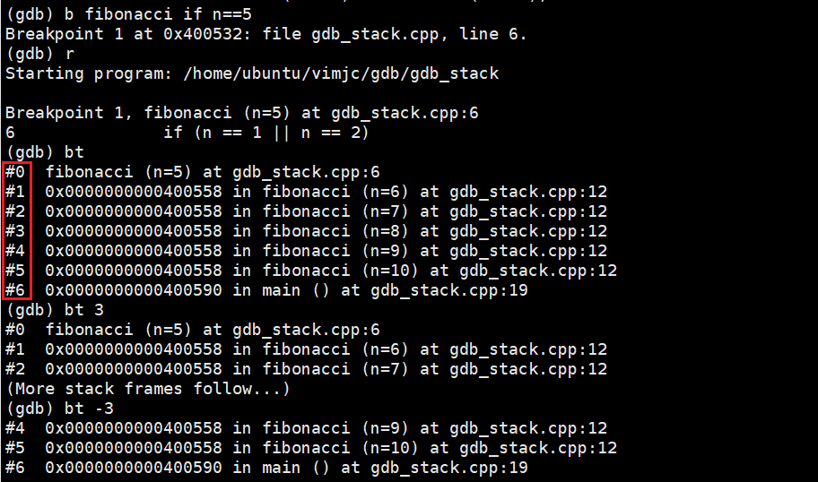
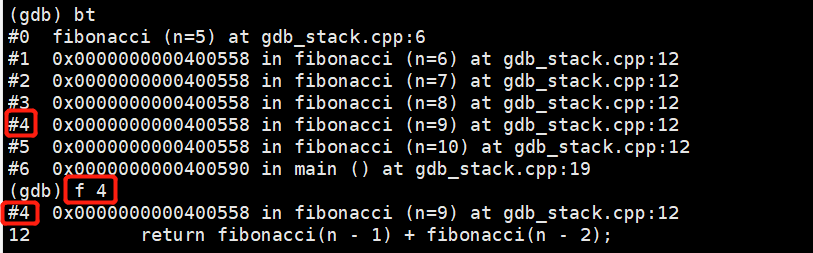
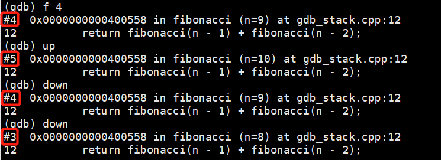
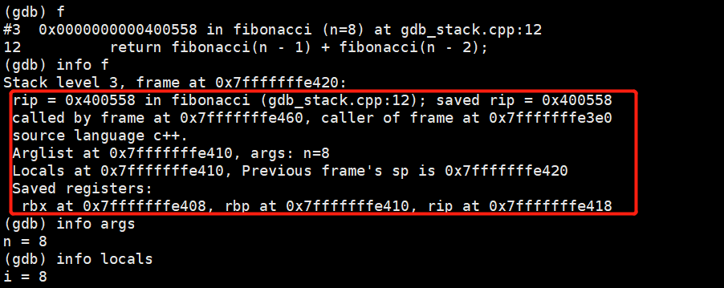
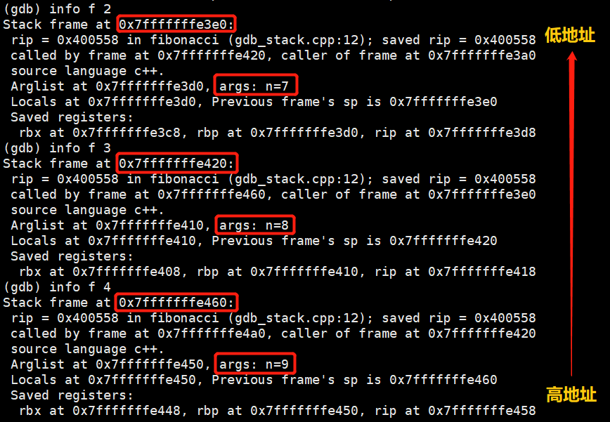

**GDB入门教程之查看函数调用堆栈**

<https://vimjc.com/gdb-stack-frame.html>

除了使用 [GDB
启动调试](https://vimjc.com/gdb-continue-debug.html)、[暂停/恢复程序执行](https://vimjc.com/gdb-continue-debug.html)和[GDB查看变量](https://vimjc.com/gdb-continue-debug.html)外，另外一个重要的调试方法便是查看程序的函数调用堆栈情况。

调用堆栈是当前函数之前的所有已调用函数的列表，每个函数及其变量都被分配了一个”栈帧”，使用
GDB
查看函数调用堆栈可清晰地看到各个函数的调用顺序以及各函数的输入形参值，是分析程序的执行流程和输入依赖的重要手段。

为了便于讲解，本文基于下述通过递归算法计算斐波拉契数列的简单 demo 进行举例说明。

```c
#include<stdio.h>
#include<stdlib.h>
        
int fibonacci(int n)
{       
    if (n == 1 || n == 2)
    {   
        return 1;
    }   

    int i = n;  // only for showing local variable in GDB
    return fibonacci(n - 1) + fibonacci(n - 2);                                                                                                            
}       
        
int main()
{       
    int n = 10; 
    int ret = 0;
    ret = fibonacci(n);
    printf("fibonacci(%d)=%d\n", n, ret);
    return 0;
}
```


**1. backtrace 命令**

要查看当前的堆栈信息，可使用 backtrace 命令
(缩写形式 bt)。堆栈中的每个函数都被分配了一个编号，最近被调用的函数在 0 号帧中
(栈顶)。

backtrace n 表示只打印栈顶上 *n* 层的栈信息
(*n* 表示一个正整数)；相反地，backtrace -n 表示只打印栈底下 *n* 层的栈信息。

以本文使用的斐波拉契数列计算 demo 为例，假设通过 b fibonacci if
n==5 设置完条件断点后启动程序，当程序被暂停时，使用 backtrace 相关命令查看到的函数调用堆栈信息如下图所示。



可以看出，当程序被暂停时，栈中共有 *7* 个栈帧，从栈顶到栈底分别被编号为 0 \~ 6。

**2. frame 命令**

如果想查看栈中某一层的信息，首先要做的是切换当前栈。这时候需用用到 frame 命令
(缩写形式为 f)。

frame n 命令表示在 GDB 下切换到编号为 *n* 的栈帧
(*n* 表示一个正整数)。例如，frame 4 将切换到栈的第 5 层。

切换完后，如果想查看当前栈帧的编号、函数名、函数参数值、函数所在文件及行号、函数执行到的语句等信息，可直接使用 frame 命令，如下图所示。



**注**：使用 frame 命令切换栈帧时，会自动打印出切换后的栈帧信息，如果切换时不想打印出任何信息，可以使用 select-frame 命令替代 frame 命令。

**3. up/down 命令**

除了使用 frame 命令切换栈帧外，还可以使用 up 和 down 命令。

down n 命令表示往栈顶方向下移 *n* 层 (*n* 表示一个正整数，默认值为
1)。相反地，up n 命令表示往栈底方向上移 *n* 层 (类似地，up 表示往栈底方向上移 1
层)。



**注**：在虚拟内存地址空间中，栈从高地址向低地址延伸
(即栈顶在下)，故往栈顶方向移动是 **down**。

同样地，up 和 down 命令都会打印出移动到的栈层的信息。如果不想让 GDB
打印出信息，可以分别使用 up-silently 和 down-silently 代替之。

**4. info 命令**

在[使用GDB查看变量](https://vimjc.com/gdb-print-variable.html)一文已经介绍过，使用 info 命令可以查看各种变量的值。

如果希望看到详细的当前栈帧的信息，如函数地址、调用函数的地址、被调用函数的地址、当前函数由哪种编程语言编写、函数参数地址及形参值、局部变量的地址等，可以使用 info
frame 命令(缩写形式 i f)。



此外，info args 命令可打印出当前函数的参数名及其形参值；info
locals 命令可打印出当前函数中所有局部变量及其值；info
catch 命令可打印出当前函数中的异常处理信息。

**5. 关于栈和栈帧**

内存栈区 (stack)
由编译器自动分配和释放，用于存放函数的形参值、局部变量的值、函数返回地址等数据，其操作方式与数据结构中的栈一致，都是后进先出的原则。在虚拟内存地址空间中，栈从高地址向低地址延伸。

栈帧 (stack frame)
是编译器用来实现函数调用的一种数据结构，是内存栈区的基本单元。内存栈空间上保持了
N 个栈帧的实体。

所有函数调用均发生在栈上，每个函数的每次调用，都有它自己独立的一个栈帧。寄存器
ebp 指向当前栈帧的底部 (高地址)，寄存器 esp 指向当前栈帧的顶部 (低地址)。

以本文使用的递归函数 fibonacci 调用为例，如下图所示，通过 info
f 命令可清晰地看到各个栈帧的地址以及由递归调用导致的栈帧切换和依赖关系
(类似：called by frame at 0x7fffffffe4a0, caller of frame at 0x7fffffffe420)。



**扩展阅读：**

1.  [GDB入门教程之如何使用GDB启动调试](https://vimjc.com/debug-program-with-gdb.html)

2.  [GDB入门教程之暂停程序](https://vimjc.com/gdb-break-program.html)

3.  [GDB入门教程之恢复程序执行](https://vimjc.com/gdb-continue-debug.html)

4.  [GDB入门教程之查看变量](https://vimjc.com/gdb-print-variable.html)


《女程序员说》

原创不易，希望能给小女子的公众号加个关注\~
