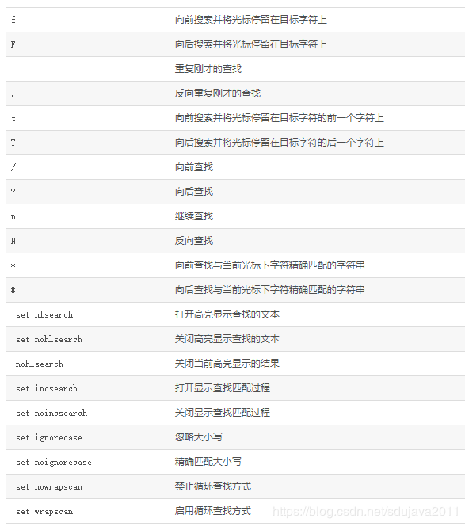

# Linux中在vim打开的文件中查找关键词

## 使用 /pattern 命令查找

vim打开文件后, 在normal模式下直接按 / 进入查找模式，输入要查找的字符并按下回车，vim会跳到第一个匹配的位置。
按n查找下一个，按Shift+n查找上一个。

### /pattern

保证大小写敏感查找, 但不保证匹配完整单词.

### ?pattern

与/pattern 类似, 不过/pattern 向下查找,  ?pattern 向上查找

### /\\<pattern\\>

被<pattern>包裹起来的, 就会只查找此完整的单词, 但因为 < > 在查找属于关键词, 所以要使用 \\< \\> 来转义.

### /\<pattern\> 和 ?\<pattern\>的快捷方式

**/\\<pattern\\> 的快捷方式为 shift + \***
**?\\<pattern\\> 的快捷方式为 sift + #**

/\\<pattern\\> 和 ?\\<pattern\\> 都需要手动输入需要查找的pattern(即: 关键词), 一般情况下我们习惯使用其快捷方式, 即在当前光标下按下shift + *  即可向下查找; 按下shift + #, 即可向上查找.

### /pattern\c

/pattern 后面跟\c, 表示忽略大小写查找, 如果一直需要忽略大小写查找, 可以通过 **:set ignorecase** (忽略大小写) 和 **:set noincsearch** (精确匹配大小写) 来设置.

## 使用vimgrep来查找

上述的 /pattern 类似于vscode/notepad++ 中的 "ctrl + f"式的查找, 即可以匹配到关键词, 但没有所有的匹配列表, 使用 vimgrep 可以实现 "ctrl + shift + f"式的查找, 即: 将所有匹配项列表出来.

vimgrep不但在当前文件查找, 也可以在当前目录查找, 
这里只介绍当前文件的查找方法, 其他可自行百度.

:vimgrep  /pattern/ %

其中, vimgrep 可以简写为 vim, 即:

:vim  /pattern/ %

## 使用grep来查找

严格的讲, grep不是vim中内置命令, 使用grep已经不算是在vim中进行查找了.但在vim中我们可以使用 :!cat xxx.c|grep pattern

这里 xxx.c 为当前文件名, 即: 在vim中通过调用外部命令的方式使用 grep, 这样也算是没有脱离当前vim编辑器了进行查找了.

### cat xxx.c|grep pattern

大小写敏感, 但不保证匹配完整单词

### cat xxx.c|grep -i pattern

-i 表示忽略大小写

忽略大小写, 但不保证匹配完整单词

### cat xxx.c|grep -w pattern

-w 表示"完整单词匹配"

大小写敏感, 但保证匹配完整单词

### cat xxx.c|grep -iw pattern

忽略大小写, 但保证匹配完整单词

### cat xxx.c|grep -n pattern

在cat xxx.c|grep pattern的基础上, 会显示输出匹配项所在的**行数**.

> **备注**  以上 -i, -w, -n 选项参数可以任意组合使用, 且组合是没有先后顺序.

### cat xxx.c|grep -E regexp

grep可以支持更加复杂的正则表达式查找.

### cat xxx.c|grep -v  filter_patter|grep pattern

grep还可以在查找时过滤某些不需要的.

### cat xxx.c|grep pattern|wc -l  或 cat xxx.c|grep -n pattern|grep -n pattern

**cat xxx.c|grep pattern|wc -l** 可以统计出匹配的数量

**cat xxx.c|grep -n pattern|grep -n pattern**
这里出现了两次grep -n pattern, cat xxx.c|grep -n pattern 表示输出文件中所有匹配项列表, 并且输出其在文件中的行数;  第二个grep -n pattern在 cat xxx.c|grep -n pattern 的结果列表再次进行匹配查找, 给结果列表添加**序号**, 通过**序号**一目了然的知道匹配了多少个.

## 三种查找方法如何选择

上述 /pattern   vimgrep, grep 均可以实现查找的目的, 在某些方面其功能有重合.

一般来说, 简单的查找, 使用 /pattern即可;
需要查找列表的使用 vimgrep;
复杂的查找, 如: 排查, 包括, 正则表达式等, 使用grep.

> **备注**: 

## 附录

### /pattern 其他命令

## 参考

[Linux shell中在vim打开的文件中查找关键字](https://blog.csdn.net/sdujava2011/article/details/89332206)